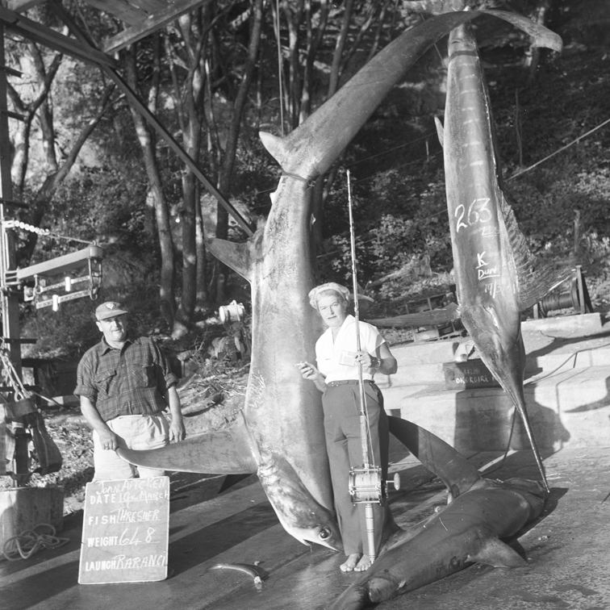

### Photograph - J.B. Aitken Shark Catch

This git repository is an Archive Object containing curated information, metadata and scanned images about a [Photograph](https://toha.io/ark:/1234/832e4dcc-f6cb-4a3f-89e8-a39dd2c9a40f) which is part of the Gifford-Cross Photographic Collection, held by Tauranga City Library and sourced from Bay of Plenty Times. The Photograph is about *J.B. Aitken Shark Catch* and features people and places in Tauranga, Bay of Plenty, New Zealand.

---



*J.B. Aitken Shark Catch*: Joan Aitken standing next to a caught shark with an unidentified man.  Details on a boards as follows: Joan Aitcken, Date: 19th March, Fish: Thresher, Weight: 648, Launch: Rarangi.

*Keywords*: People, Thresher shark, Fishing, Women

| Details       |         |
| ------------- | -------- |
| *Item Id*     | [832e4dcc-f6cb-4a3f-89e8-a39dd2c9a40f](https://toha.io/ark:/1234/832e4dcc-f6cb-4a3f-89e8-a39dd2c9a40f) |
| *Collection*  | Gifford-Cross Photographic Collection |
| *Created By*  | Photographer John Holden |
| *Date Created* | 1961-03-21 |
| *Permalink*   | [https://toha.io/ark:/1234/832e4dcc-f6cb-4a3f-89e8-a39dd2c9a40f](https://toha.io/ark:/1234/832e4dcc-f6cb-4a3f-89e8-a39dd2c9a40f) |

### Citing this Artifact

Please cite this Photograph using the following details or download the [BibTex file](metadata/reference.bib).

> Holden, John. Photograph J.B. Aitken Shark Catch. Gifford-Cross Photographic Collection Toha Digital Archive. 0.0.1. Bay of Plenty Times and Tauranga City Library. 1961.<br />
  [https://toha.io/ark:/1234/832e4dcc-f6cb-4a3f-89e8-a39dd2c9a40f.](https://toha.io/ark:/1234/832e4dcc-f6cb-4a3f-89e8-a39dd2c9a40f.)

---

### Archive Objects

This archive provides [comprehensive metadata](metadata/description.json) in [JSONLD](https://www.w3.org/TR/json-ld/) format using the [Schema.org](https://schema.org) schema. For terms and vocabulary, where appropriate, the metadata uses terms defined in other controlled vocabularies. Bagit formated archives are available under the [```achiveobject``` branch](https://github.com/tgalib/ao-832e4dcc-f6cb-4a3f-89e8-a39dd2c9a40f/tree/archiveobject) of this repository. [Releases](https://github.com/tgalib/ao-832e4dcc-f6cb-4a3f-89e8-a39dd2c9a40f/releases) that are compressed (zipped) mime encoded files derived from [signed tagged versions](https://git-scm.com/book/en/v2/Git-Basics-Tagging) of the ```archiveobject``` branch will be periodically made. A permanent Web representation of this Photograph is always provided by the [ARK permalink](https://toha.io/ark:/1234/832e4dcc-f6cb-4a3f-89e8-a39dd2c9a40f).

Using Git and Github for digitalising and archving historical public records is a new approach and therefore is **experimental** at this time. These archives despite using good practise for metadata, fixity, Url naming and provennace tracking (via qualified research using an [open curation policy](POLICY.md), [opened linked data](https://www.w3.org/standards/semanticweb/data), and [git signed](https://git-scm.com/book/en/v2/Git-Tools-Signing-Your-Work) [commits and tagging](https://github.com/blog/2144-gpg-signature-verification)) are just an experimental prototype.

Use of ARKs have not been registered and no expectation about permanence of this archive or the ARK URL is given or should be implied.

Wider project documentation (when developed) can be found at [docs.toha.io](https://docs.toha.io).

### Contributing

Developing comprehesive and accurate descriptive meta-data about an artifact is time consuming and fraught with inaccuracies or missing detail. You can help by:

1. [Raising issues](https://github.com/tgalib/ao-832e4dcc-f6cb-4a3f-89e8-a39dd2c9a40f/issues) and contributing to any discussion about the image, the people, organisations, properties, or places featured, or memories about the specific event.

2. Collect related helpful background information [on the Wiki](https://github.com/tgalib/ao-832e4dcc-f6cb-4a3f-89e8-a39dd2c9a40f/wiki) for this Archive Object. We'll be putting related notes, dicussion/meeting notes about decisions made that affect the metadata, artifact's digital representation (images, content etc.) and releases there too.

3. You can directly contribute to adding metadata by [forking this repository](https://help.github.com/articles/fork-a-repo/), making the changes and then sending us a [Pull Request](https://help.github.com/articles/creating-a-pull-request/).

A comphensive [contribution policy](CONTRIBUTOR.md) will be developed as we find our feet. The [policy](CONTRIBUTOR.md) outlines and guides the use of the three ways you can contribute. It will also outline how we- as archive adminstrators with an overall curatorial role- will use and update this archive, the publication process, release creation, issues and wiki moderation.

Our [Curation and Research Policy](POLICY.md) will outline how we are approaching the curation and publication of digital artifacts and the assoicated metadata. The [Policy](POLICY.md) will also aim to outline how we will apply this to community discussions and pull requests.

Each archive object collects and collates information about a single artifact of interest. These can be Photographs, Artworks, Film, Interviews and more. Each artifact is contributed to our archives under different terms and depending on what they represent may have other overiding considerations- such as cultural sensitivies. To reflect this each [contributor](CONTRIBUTOR.md) and [curation and research policy](POLICY.md) may be unique to the individual Archive Object. In general we'll endeavour to keep them consistent for all artifacts that are part of a collection.

### Metadata

The type and range of metadata to be collected is an open question. We're still trying to figure out what should be recorded, how it should be recorded in terms of schema and vocabularies. At the moment the [metadata](metadata/description.json) is encoded as [Schema.org](https://schema.org) using [JSONLD](https://www.w3.org/TR/json-ld/). We will be expanding this to include additional metadata, for example [provenance](https://www.w3.org/TR/prov-overview/) and [turtle](https://www.w3.org/TR/turtle/) encodings. When a decision has to be made about what schema and encodings will be used the preference will be given to [W3C](https://www.w3.org) *Semantic Web* and *Linked Open Data* standards.

**Disclaimer**: All metadata provided "as­is" and without any representations or warranties of any kind concerning the metadata, express, implied, statutory or otherwise, including without limitation warranties of title, merchantability, fitness for a particular purpose, non­infringement, or the absence of latent or other defects, accuracy, or the presence or absence of errors, whether or not discoverable, all to the greatest extent permissible under applicable law.

### Copyright and Licence Information

Copyright Bay of Plenty Times / All Rights Reserved

This copyright notice and associated licence only applies to the artifact and not necessarily the digital representation, the archive object repository ([covered by the repository licence](LICENSE.md)) or the metadata [covered by the metadata licence](metadata/LICENSE.md)).

Tauranga City Library does not own the copyright in all the material featured on this website. In some cases copyright belongs to third parties and has been published here under a licence agreement: this does not authorise you to copy that material. You may be required to obtain permission from the copyright owner.

Some unpublished material may require permission for reuse even if it is very old. Orphan works, where the copyright owner is unknown,also require permission for reuse. Indigenous works may have additional legal and cultural issues. You may be required to seek cultural clearances from Māori, Pacific Island or other ethnic communities, families, individuals or organisations before you may reproduce any material.

### Additional Licence Information

See the [repository licence](LICENSE.md) for more details about using the archive object repository, or the [metadata licence](metadata/LICENSE.md) for using the descriptive metadata. In some situations individual digital representations (such as different image sizes, resolutions or encodings) may have a separate licence that permits or restricts wider reuse. More details on the applicable licence can be found in the [descriptive metada](metadata/description.json).

### Requesting Permission to Reuse

*Please [contact us](mailto:licensing+readme@toha.io?subject=Query%20about%20licensing%20Photograph%20-%20J.B.%20Aitken%20Shark%20Catch%20832e4dcc-f6cb-4a3f-89e8-a39dd2c9a40f) if you need clarification or want to seek permission to use any metadata, information or digital representations (such as the digital images).*

